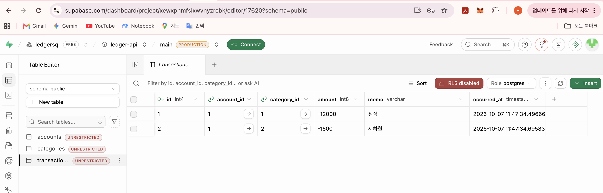
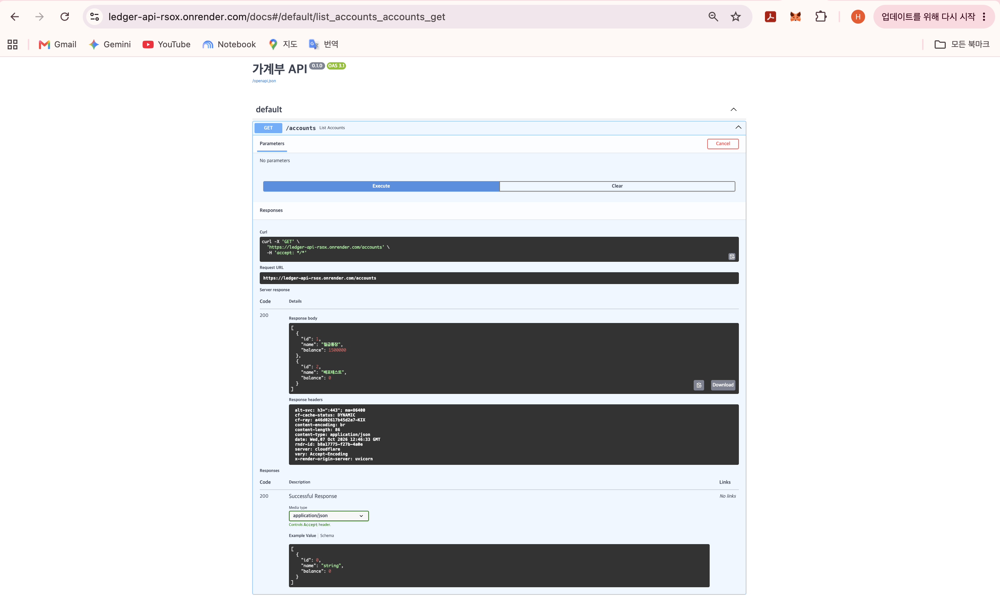

GitHub: https://github.com/haedallab/ledger-api · Render: https://ledger-api-rsox.onrender.com

# 가계부 API (FastAPI + Supabase PostgreSQL)

## 1. 결과 확인

### Supabase Table Editor 거래 내역

### Render 배포 Swagger UI (/docs) - GET /accounts

---

## 2. 핵심 개념 되새김

- **계좌·거래를 두 테이블로 나눈 이유 (1:N 관계)**: 하나의 계좌에 여러 건의 입출금 거래가 발생하므로, 중복 데이터를 줄이고 계좌 정보와 개별 거래 내역을 체계적으로 관리하기 위해 분리했다.
- **SQLAlchemy 모델 클래스와 실제 테이블의 대응**: 파이썬 코드의 객체지향 클래스 정의(속성, 타입, 제약조건)를 ORM이 데이터베이스의 실제 테이블 스키마 및 레코드로 자동 변환·매핑해 준다.
- **접속 문자열을 .env로 분리하는 이유**: 데이터베이스 비밀번호, 호스트 주소 등 민감한 인증 정보를 Git 소스코드에 직접 노출하지 않고 환경 변수로 안전하게 격리·관리하기 위함이다.

---

## 3. 자유 로그

- **오늘 배운 것**: FastAPI와 SQLAlchemy를 활용한 ORM 모델 구성, Supabase PostgreSQL 연동 및 Render를 통한 클라우드 배포 파이프라인.
- **막힌 곳과 해결 과정**: Render 배포 시 GitHub 권한 설정 문제로 저장소가 보이지 않았으나, GitHub Settings의 Installed Applications에서 Render 앱 접근 권한을 추가하여 해결했다.
- **AI 활용 및 결과 검증**: AI에게 Supabase 세션 풀러 연결 문자열 설정과 Render 연동 트러블슈팅을 요청했고, Render 대시보드의 실시간 빌드 로그와 `/docs` 엔드포인트를 직접 열어 정상 구동을 검증했다.